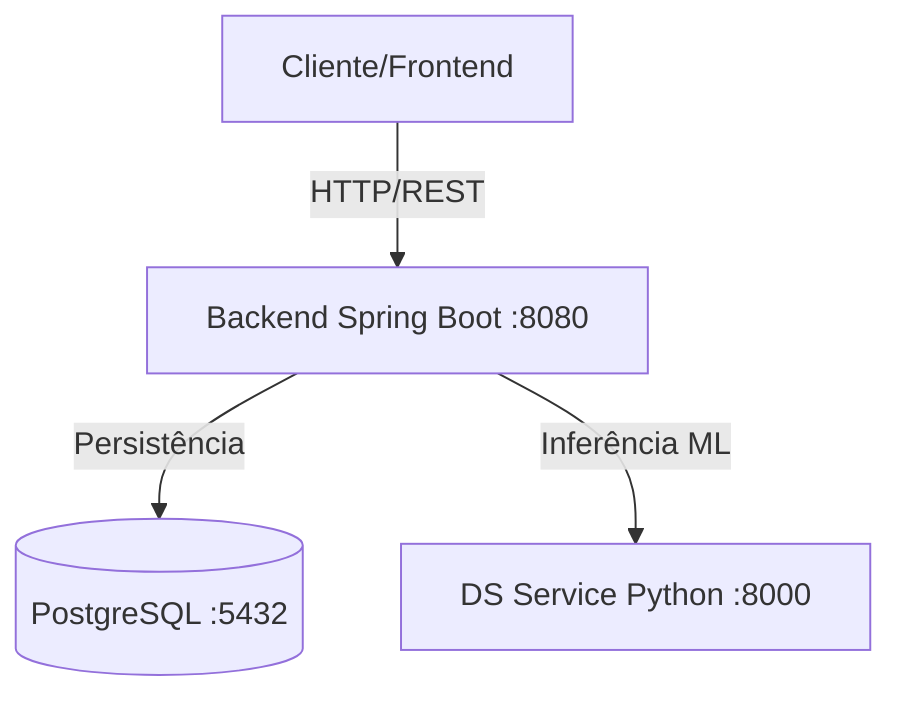

# Sentiment API - Hackathon One 🚀

API para análise de sentimentos em textos utilizando Machine Learning, desenvolvida para a etapa final do Hackathon One.

## 📋 Visão Geral

Este projeto implementa uma solução de análise de sentimentos que classifica um texto como **Positivo** ou **Negativo**, com a probabilidade associada.

A solução integra um backend em **Java/Spring Boot** com um microserviço de **Data Science em Python**, orquestrados via Docker.

### Sobre o modelo

O classificador é `TF-IDF` + `LogisticRegression` (scikit-learn), treinado com **4.044 avaliações do parque de diversões Hopi Hari** — não é um modelo de e-commerce ou redes sociais, e a acurácia fora desse domínio não foi medida. É **binário**: não existe classe "Neutro" (decisão registrada em `nginx/docs/adr/ADR-004-modelo-treinado-e-contrato-binario.md`). O modelo também é sensível a acentuação — remover acentos do texto de entrada degrada a classificação.

Se o artefato do modelo não carregar, o serviço cai num fallback heurístico simples — de propósito, para não derrubar a API — mas isso é **sinalizado explicitamente** em `GET /api/v1/health` (`mode: "model"` ou `"fallback"`), nunca silencioso. Detalhes completos em `nginx/docs/ml-model-card.md`.

## 🔗 Demonstração Online (Live Demo)

O projeto está implantado e acessível na Oracle Cloud Infrastructure (OCI).

> Infraestrutura e deploy em OCI (provisionamento da instância e scripts de automação): **André Teixeira**.

| Componente | URL |
| :--- | :--- |
| **API, Backend & Frontend** | [http://152.67.61.11:8080/](http://152.67.61.11:8080/) |
| **Documentação da API (Swagger)** | [http://152.67.61.11:8080/swagger-ui.html](http://152.67.61.11:8080/swagger-ui.html) |

O frontend é servido pelo próprio Spring Boot (não por um container Nginx separado) — por isso a mesma URL da API.

## 📺 Vídeo de Demonstração

Assista ao vídeo de apresentação e demonstração do projeto:

[](https://www.youtube.com/watch?v=aOJWGQSNn5k)

---

## 🛠️ Tecnologias Utilizadas

| Camada | Tecnologias |
| :--- | :--- |
| **Backend** | Java 17, Spring Boot 3.2, Spring Data JPA, Lombok |
| **Data Science** | Python 3.11, FastAPI, Scikit-learn, Pandas |
| **Banco de Dados** | PostgreSQL 15 |
| **Infraestrutura** | Docker, Docker Compose, Oracle Cloud (OCI) |

## 🏗️ Arquitetura do Sistema

O diagrama a seguir ilustra a arquitetura de microsserviços do projeto:



## 🚀 Como Executar Localmente

### Pré-requisitos

Certifique-se de ter o **Docker** e o **Docker Compose** instalados em sua máquina, além do **Git**.

### Passo a Passo

1.  **Clone o repositório:**
    ```bash
    git clone https://github.com/AndreTeixeir/hackathon-one-sentiment-api.git
    cd hackathon-one-sentiment-api
    ```

2.  **Suba os containers:**
    ```bash
    docker-compose up -d --build
    ```

3.  **Acesse os serviços:**
    *   **API:** `http://localhost:8080/api/v1/sentiment`
    *   **DS Service Health:** `http://localhost:8000/health`

## 🔌 Endpoints

| Método | Endpoint | Descrição |
| :--- | :--- | :--- |
| `POST` | `/api/v1/sentiment` | Analisa um texto avulso e retorna o sentimento (Positivo ou Negativo) com a probabilidade. |
| `POST` | `/api/v1/sentiment/batch` | Analisa uma lista de textos de uma vez. |
| `GET` | `/api/v1/stats` | Estatísticas agregadas de todas as análises já feitas. |
| `GET` | `/api/v1/health` | Saúde da aplicação e do microserviço de ML — inclui se o modelo real está carregado ou se está em modo de fallback. |

> Para a lista completa (incluindo schemas de request/response), consulte a documentação Swagger na URL de demonstração.

## 📂 Estrutura do Projeto

*   `/backend/sentiment-backend`: Código fonte da API principal em Java/Spring Boot (o frontend estático também mora aqui, em `src/main/resources/static/`).
*   `/ds-service`: Microserviço Python de Machine Learning (FastAPI).
*   `/datascience`: Notebooks (Jupyter) de treino do modelo e datasets.
*   `/nginx/docs`: Documentação técnica detalhada (arquitetura, requisitos, model card, ADRs).
*   `/scripts`: Scripts de automação para deploy na OCI.

## 👥 A Equipa (Participantes)

| Participante | LinkedIn |
| :--- | :--- |
| **Eiky Oliveira Albuquerque** | [Perfil LinkedIn](https://www.linkedin.com/in/eikyalbuquerque) |
| **Brena Stephany Chagas Paula** | [Perfil LinkedIn](https://www.linkedin.com/in/brena-stephany) |
| **Luiz Carlos Tannous Del Nero** | [Perfil LinkedIn](https://www.linkedin.com/in/luiz-carlos-tannous-del-nero-b44166255) |
| **Letícia de Almeida Ferreira** | [Perfil LinkedIn](http://linkedin.com/in/leticia-de-almeida-ferreira-18086a180) |
| **André Teixeira** | [Perfil LinkedIn](https://www.linkedin.com/in/andreteixeir) |

## 📄 Licença

Este projeto está sob a licença [MIT](https://opensource.org/licenses/MIT).
